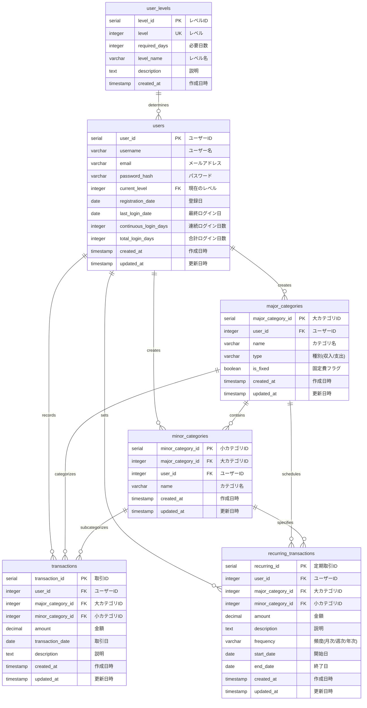

```mermaid
erDiagram
 users ||--o{ major_categories : creates
    users ||--o{ minor_categories : creates
    users ||--o{ transactions : records
    users ||--o{ recurring_transactions : sets
    user_levels ||--o{ users : determines

    major_categories ||--o{ minor_categories : contains
    major_categories ||--o{ transactions : categorizes
    major_categories ||--o{ recurring_transactions : schedules

    minor_categories ||--o{ transactions : subcategorizes
    minor_categories ||--o{ recurring_transactions : specifies

    users {
        serial user_id PK "ユーザーID"
        varchar username "ユーザー名"
        varchar email "メールアドレス"
        varchar password_hash "パスワード"
        integer current_level FK "現在のレベル"
        date registration_date "登録日"
        date last_login_date "最終ログイン日"
        integer continuous_login_days "連続ログイン日数"
        integer total_login_days "合計ログイン日数"
        timestamp created_at "作成日時"
        timestamp updated_at "更新日時"
    }

    user_levels {
        serial level_id PK "レベルID"
        integer level UK "レベル"
        integer required_days "必要日数"
        varchar level_name "レベル名"
        text description "説明"
        timestamp created_at "作成日時"
    }

    major_categories {
        serial major_category_id PK "大カテゴリID"
        integer user_id FK "ユーザーID"
        varchar name "カテゴリ名"
        varchar type "種別(収入/支出)"
        boolean is_fixed "固定費フラグ"
        timestamp created_at "作成日時"
        timestamp updated_at "更新日時"
    }

    minor_categories {
        serial minor_category_id PK "小カテゴリID"
        integer major_category_id FK "大カテゴリID"
        integer user_id FK "ユーザーID"
        varchar name "カテゴリ名"
        timestamp created_at "作成日時"
        timestamp updated_at "更新日時"
    }

    transactions {
        serial transaction_id PK "取引ID"
        integer user_id FK "ユーザーID"
        integer major_category_id FK "大カテゴリID"
        integer minor_category_id FK "小カテゴリID"
        decimal amount "金額"
        date transaction_date "取引日"
        text description "説明"
        timestamp created_at "作成日時"
        timestamp updated_at "更新日時"
    }


    recurring_transactions {
        serial recurring_id PK "定期取引ID"
        integer user_id FK "ユーザーID"
        integer major_category_id FK "大カテゴリID"
        integer minor_category_id FK "小カテゴリID"
        decimal amount "金額"
        text description "説明"
        varchar frequency "頻度(月次/週次/年次)"
        date start_date "開始日"
        date end_date "終了日"
        timestamp created_at "作成日時"
        timestamp updated_at "更新日時"
    }
```
